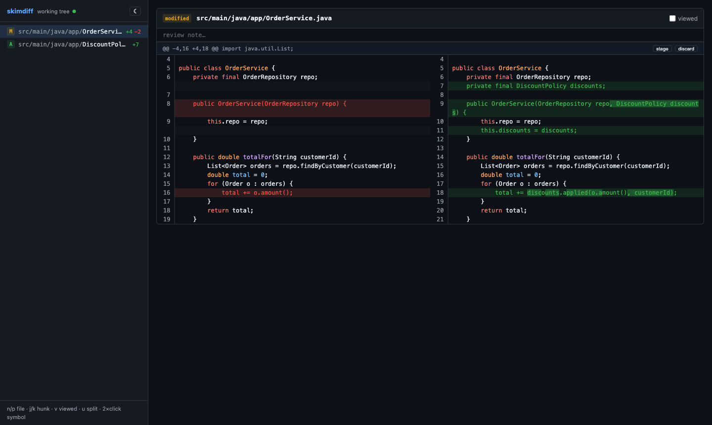

# skimdiff

[](https://github.com/techsavd/skimdiff/actions/workflows/ci.yml)
[](https://github.com/techsavd/skimdiff/releases)
[](LICENSE)

Lightweight review of agent-made code changes — a single binary that serves a
fast diff UI in your browser. No IDE, no Electron, no LSP.



```
cd your-repo
skimdiff                 # live working-tree diff, auto-refreshes as files change
skimdiff main..feature   # review a branch
skimdiff HEAD~3          # review the last 3 commits
```

## Why

Coding agents produce diffs faster than you can review them, and firing up
IntelliJ or VS Code just to *read* a change costs gigabytes of RAM. skimdiff
starts in milliseconds, idles at ~10&nbsp;MB, and still gives you the two
things a plain `git diff` can't: a real review workflow and find-usages.

## Features

- **Live mode** — watches the working tree (gitignore-aware) and refreshes the
  browser as an agent edits files.
- **Proper diff rendering** — side-by-side or unified, word-level intra-line
  highlights, syntax highlighting, light/dark theme.
- **Review flow** — mark files viewed, leave notes (persisted in
  `.git/skimdiff/`, never touches your working tree), stage or discard
  individual hunks.
- **Code navigation without an LSP** — double-click any symbol for
  declarations and usages via a tree-sitter index (Java, Kotlin, Go, Python,
  JS/TS). Syntax-aware: mentions in strings and comments don't count.
- **Keyboard-first** — `n`/`p` file, `j`/`k` hunk, `v` viewed, `u` toggle
  split, `Esc` close panels.

## Install

**Homebrew** (macOS arm64/Intel, Linux x86_64/arm64):

```bash
brew install techsavd/tap/skimdiff
```

**Prebuilt binaries** — grab a tarball from the
[releases page](https://github.com/techsavd/skimdiff/releases) and put
`skimdiff` on your PATH.

**From source** (requires Rust and Node):

```bash
git clone https://github.com/techsavd/skimdiff && cd skimdiff
cd web && npm install && npm run build && cd ..
cargo install --path .
```

## Flags

- `--port <n>` — listen port (default 4400; falls back to a free port)
- `--no-open` — don't open the browser

The server binds `127.0.0.1` only.

## Development

```bash
cargo test              # behavior contract: diff parsing, watcher, endpoints, index
cd web && npm run dev   # frontend dev server proxying /api to :4400
```

Design notes in [`docs/design.md`](docs/design.md).

## Releasing

Push a `v*` tag. CI builds binaries for macOS (arm64, x86_64) and Linux
(x86_64, arm64), publishes a GitHub release, and updates the
[Homebrew tap](https://github.com/techsavd/homebrew-tap) formula
automatically (requires the `TAP_GITHUB_TOKEN` repo secret).

## License

[MIT](LICENSE)
